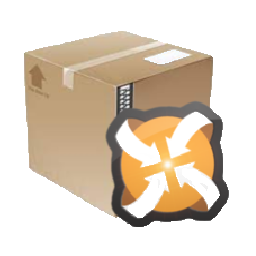

# Nexus Build App

Nexus Build App is a command-line tool for automating the packaging process of Nexus mods.

This application consumes .nxproj files: custom XML files. These files:

 * Stores all rules to allow the packager to find you mod files into a game 
   installation folder. These rules can be a combination of:
    * A list of hardcored files;
    * All files starting with some prefix, and with a specific extension;
    * Allows the search in just some specific directories.
   The packager will preserve the same directory-hierarchy of all copied files.

 * At the end, will be packaged into a ZIP, in a custom destination folder

